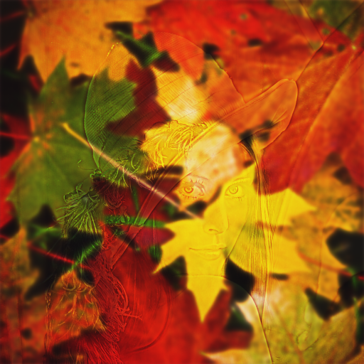

This code mixes two images into one with a bit of machine learning.

Trainable variable is an image itself. Loss is a mix of two losses - pixelwise difference with first label image and pixelwise difference between blurred image and blurred second label image.

In image above loss for first label multiplied by 0.1.

Images were published on wikipedia under creative commons. Source code is free, you can use it for any purpose.